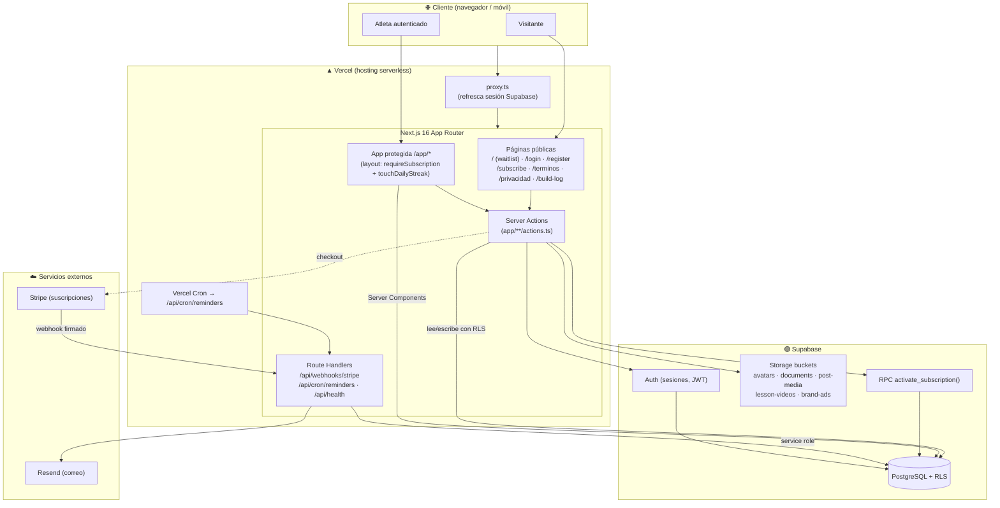
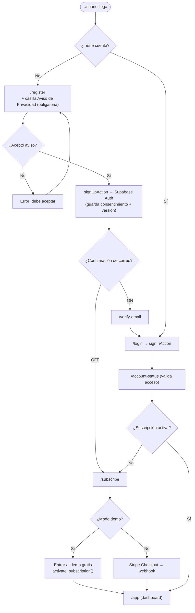
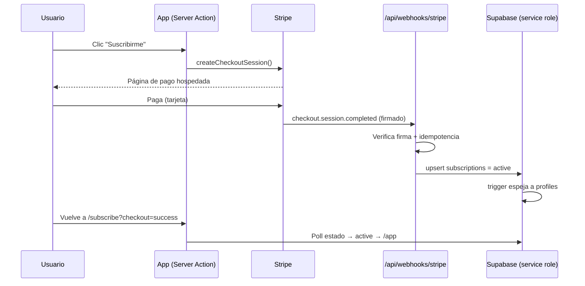
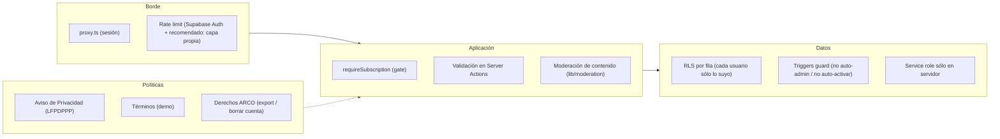
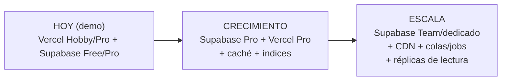

# Ximo — Internal Connection Graph

Everything connected inside Ximo: frontend, backend, database, auth, APIs, storage,
user flows, security layers, policies, and future infrastructure. Rendered with
Mermaid (GitHub renders these natively).

## 1. System architecture

## 2. Authentication & access flow

## 3. Payment flow (post-demo)

## 4. Security & policy layers

## 5. Future infrastructure (scaling path)

Ver detalle en [infrastructure-scaling.md](infrastructure-scaling.md), seguridad en
[security-plan.md](security-plan.md), y rendimiento en [data-flow-performance.md](data-flow-performance.md).
